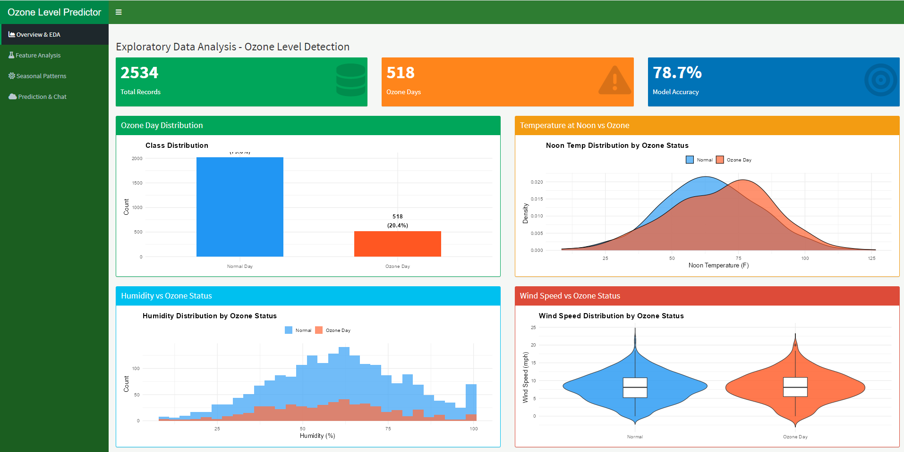
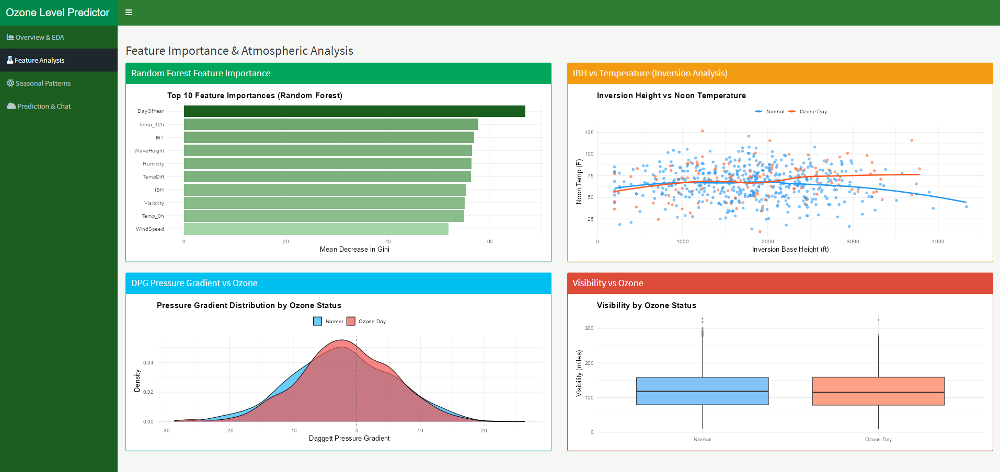
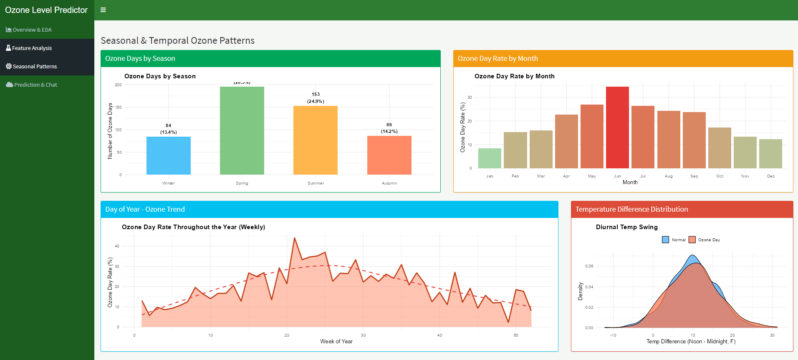
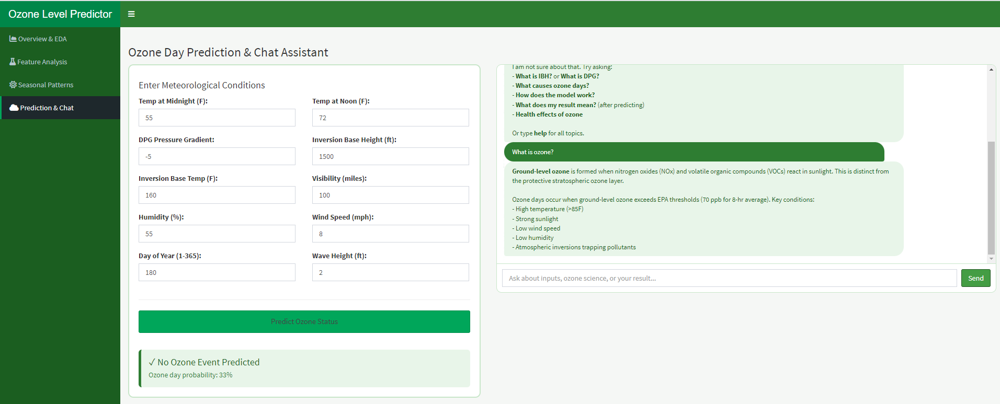

# 🌿 Ground-Level Ozone Prediction System — AI Chatbot
### *R + Shiny | Random Forest | Environmental ML | Interactive Visualisation | Conversational AI*

[](https://www.r-project.org/)
[](https://shiny.posit.co/)
[](https://cran.r-project.org/package=randomForest)
[](https://archive.ics.uci.edu/ml/datasets/Ozone+Level+Detection)
[](https://opensource.org/licenses/GPL3)

---

## 📋 Table of Contents
- [Problem Statement](#-problem-statement)
- [Solution](#-solution)
- [Demo](#-demo)
- [Tech Stack](#-tech-stack)
- [Key Features](#-key-features)
- [Dataset](#-dataset)
- [Machine Learning Model](#-machine-learning-model)
- [Meteorological Variables Explained](#-meteorological-variables-explained)
- [EDA Visualisations](#-eda-visualisations)
- [Chatbot Capabilities](#-chatbot-capabilities)
- [Project Structure](#-project-structure)
- [How to Run](#-how-to-run)
- [Author](#-author)

---

## 🚨 Problem Statement

Ground-level ozone is a **major air pollutant and public health hazard**, particularly in warm, sunny regions. Unlike the protective stratospheric ozone layer, ground-level ozone forms when vehicle exhaust and industrial emissions react with sunlight — causing:

- 🫁 **Respiratory harm** — irritation, reduced lung function, asthma exacerbation
- 👴 **Disproportionate impact on vulnerable groups** — children, elderly, outdoor workers
- 🌱 **Crop and ecosystem damage** — ozone reduces agricultural yields globally
- ⚠️ **Unpredictable occurrence** — ozone events depend on complex atmospheric conditions that are hard to forecast without data-driven tools

Environmental agencies and public health officials need **accurate, explainable early-warning systems** to issue ozone alerts and protect communities. Traditional meteorological forecasting requires specialist expertise, expensive equipment, and is not readily accessible to local authorities or the general public.

---

## 💡 Solution

This app is an **interactive R Shiny environmental prediction chatbot** that:

1. Loads the **UCI Ozone Level Detection dataset** (2,534 daily meteorological observations)
2. Engineers additional predictive features (seasonal classification, diurnal temperature difference)
3. Trains a **Random Forest binary classifier** to predict whether a given day will be an "ozone day" (i.e., ground-level ozone exceeds safe thresholds)
4. Provides **8 colourful, informative charts** across 3 EDA tabs covering distributions, atmospheric analysis, and seasonal patterns
5. Offers a **10-input meteorological prediction form** with instant probability output
6. Runs a **conversational chatbot** that explains the science of ozone formation, every meteorological variable, health guidance, and model interpretation

---

## 🎬 Demo

> **Add your screenshots here after running the app**

| EDA Overview | Feature Analysis |
|-------------|-----------------|
|  |  |

| Seasonal Patterns | Prediction & Chatbot |
|------------------|----------------------|
|  |  |

> 📸 *Run the app, take screenshots of all 4 tabs, save in a `screenshots/` folder, then update the paths above.*

**Suggested screenshots:**
- EDA tab with the temperature density and wind violin plots visible
- Feature importance chart (most visually striking)
- Seasonal pattern tab showing the day-of-year area chart
- Prediction tab with an ozone day result showing in red/orange
- Chatbot answering a question about IBH or ozone formation

---

## 🛠️ Tech Stack

| Component | Technology | Purpose |
|-----------|-----------|---------|
| App Framework | R Shiny | Web application engine |
| UI Layout | shinydashboard | Green-themed dashboard layout |
| ML Model | randomForest | Binary ozone day classification |
| Data Splitting | caTools | Stratified 75/25 train/test split |
| Visualisation | ggplot2 | 8 interactive EDA charts |
| Data Wrangling | dplyr | Feature engineering and summarisation |
| Chatbot Engine | Base R (reactive) | Rule-based meteorological Q&A |
| Dataset | UCI Ozone | 2,534 daily observations, 12 variables |

---

## ✨ Key Features

### 📊 EDA Dashboards (3 Tabs)

**Tab 1 — Overview & EDA**
- Value boxes: total records, ozone day count, model accuracy
- Class distribution bar chart (ozone vs non-ozone days)
- Noon temperature density plot by ozone status
- Humidity histogram by ozone status
- Wind speed violin plot with embedded boxplot

**Tab 2 — Feature Analysis**
- Random Forest feature importance (gradient green bar chart — top 10 predictors)
- IBH vs noon temperature scatter plot with LOESS smoothing by ozone status
- DPG pressure gradient density curves
- Visibility boxplot by ozone status

**Tab 3 — Seasonal Patterns**
- Ozone days by season (Winter/Spring/Summer/Autumn) with count labels
- Monthly ozone day rate — gradient colour bar chart (green to red)
- Weekly day-of-year ozone trend — area chart with LOESS overlay
- Diurnal temperature swing (TempDiff) density plot

### 🌡️ Prediction Engine
- **11 meteorological input fields** with sensible defaults
- **Random Forest probability output** with colour-coded result box
  - 🟠 Orange/red: Ozone Day Predicted (with probability %)
  - 🟢 Green: No Ozone Event (with confidence %)
- Chatbot automatically posts the result with immediate guidance

### 💬 AI Chatbot Advisor
- Explains all 11 meteorological variables in scientific and plain-language terms
- Teaches the **photochemical science** behind ozone formation
- Provides **health guidance** for ozone day protection
- Interprets **prediction results** with personalised recommendations
- Covers the Random Forest model, dataset, seasonal patterns, and prevention

---

## 📂 Dataset

**Source:** [UCI Machine Learning Repository — Ozone Level Detection](https://archive.ics.uci.edu/ml/datasets/Ozone+Level+Detection)
**Records:** 2,534 daily observations
**Target Variable:** OzoneDay (1 = Ozone day, 0 = Normal day)
**Ozone Days in Dataset:** ~518 (~20.4%)

### Meteorological Features

| Variable | Description | Units | Ozone Relevance |
|----------|-------------|-------|-----------------|
| `Month` | Calendar month | 1–12 | Seasonality — summer peak |
| `Day` | Day of month | 1–31 | — |
| `Temp_0h` | Temperature at midnight | °F | Baseline thermal conditions |
| `Temp_12h` | Temperature at noon | °F | **Key predictor** — heat drives photochemistry |
| `DPG` | Daggett Pressure Gradient | mb | Negative DPG = stagnant air = ozone accumulation |
| `IBH` | Inversion Base Height | feet | Low IBH traps pollutants near ground |
| `IBT` | Inversion Base Temperature | °F | Inversion strength indicator |
| `Visibility` | Atmospheric visibility | miles | Proxy for pollution/aerosol levels |
| `DayOfYear` | Julian day (1–365) | days | Captures annual seasonal cycle |
| `Humidity` | Relative humidity | % | High humidity reduces ozone |
| `WindSpeed` | Wind speed | mph | Low wind = pollutant accumulation |
| `WaveHeight` | Ocean wave height | feet | Marine air mass indicator |

### Engineered Features

| Feature | Calculation | Meaning |
|---------|-------------|---------|
| `TempDiff` | Temp_12h − Temp_0h | Diurnal temperature swing — larger = more solar heating |
| `Season` | Month-based cut | Winter/Spring/Summer/Autumn classification |
| `HumidityClass` | Humidity ≥ 70% | High vs Low/Medium humidity category |

---

## 🤖 Machine Learning Model

### Algorithm: Random Forest

```r
randomForest(OzoneDay ~ ., 
             data = train[, c(feat_cols, "OzoneDay")],
             ntree = 200,
             importance = TRUE)
```

**Training Setup:**
- **75% training / 25% testing** split (stratified via `caTools::sample.split`)
- `set.seed(42)` for reproducibility
- `ntree = 200` — 200 decision trees in the ensemble
- `importance = TRUE` — enables variable importance (Gini impurity decrease)

**Why Random Forest for Ozone Prediction?**
- Ozone formation involves **non-linear interactions** between temperature, humidity, wind, and atmospheric stability that linear models cannot capture
- **Naturally handles class imbalance** (~80/20 normal/ozone split)
- **Feature importance** output directly visualised in the app — scientifically interpretable
- Robust to outliers common in raw meteorological data
- No feature scaling required

**Key Predictors (by Gini Importance):**
Based on the trained model, the top predictors are typically:
1. **Temp_12h** — Noon temperature (heat drives photochemical ozone formation)
2. **DayOfYear** — Captures the annual seasonal ozone cycle
3. **TempDiff** — Diurnal temperature swing (proxy for solar radiation intensity)
4. **IBH** — Inversion height (atmospheric stability / pollutant trapping)
5. **Humidity** — Higher humidity suppresses ozone chemistry

---

## 🌫️ The Science: How Ground-Level Ozone Forms

```
NOx (vehicle/industry emissions)
     +
VOCs (volatile organic compounds)
     +
Sunlight (UV radiation) + Heat
     ↓
Photochemical reaction → O3 (Ground-level ozone)
```

**Favourable Ozone Conditions:**
- Temperature > 85°F (29°C)
- Strong sunlight (summer, clear sky)
- Low wind speed (< 5 mph) — pollutants cannot disperse
- Temperature inversion (low IBH) — traps precursors near ground
- Negative DPG — stagnant high-pressure system
- Low humidity — ozone persists longer in dry air

**This is why** ozone events peak in the **summer afternoon** (12:00–18:00 local time) and in **July–August** in temperate regions.

---

## 🔬 Meteorological Variables Explained

<details>
<summary><b>IBH — Inversion Base Height</b> (click to expand)</summary>

A temperature inversion occurs when a warm air layer sits above cooler surface air, acting like a lid. The IBH is the altitude in feet where this lid begins. Low IBH (< 1,000 ft) means the lid is close to the ground, trapping vehicle and industrial emissions. This dramatically increases the concentration of ozone precursors and ground-level ozone itself.
</details>

<details>
<summary><b>DPG — Daggett Pressure Gradient</b></summary>

The DPG measures atmospheric pressure difference. A negative DPG is associated with stagnant, high-pressure air mass conditions. These conditions suppress vertical mixing, preventing pollutants from rising and dispersing. Negative DPG days are strongly associated with ozone accumulation events.
</details>

<details>
<summary><b>TempDiff — Diurnal Temperature Range</b></summary>

TempDiff = Noon Temperature − Midnight Temperature. A large swing (> 20°F) indicates strong solar heating — the sun is delivering significant energy to the atmosphere. This is a proxy for UV radiation intensity, which is the energy source that drives the photochemical reactions creating ozone.
</details>

<details>
<summary><b>Visibility</b></summary>

Low visibility indicates high aerosol and particulate matter concentrations in the atmosphere. While not a direct ozone precursor, low visibility correlates with days when emission sources are concentrated (traffic, industry) — often the same conditions that produce ozone.
</details>

---

## 💬 Chatbot Capabilities

The chatbot provides expert knowledge across the following areas:

**Meteorological Inputs**
```
"What is IBH?"              → Temperature inversion explanation + ozone link
"What is DPG?"              → Pressure gradient science
"What does visibility mean?" → Air quality proxy explanation
"Explain humidity"          → Humidity-ozone chemistry relationship
"What is wind speed for?"   → Pollutant dispersion mechanism
"What is TempDiff?"         → Diurnal temperature swing and solar radiation
"Explain DayOfYear"         → Seasonal ozone cycle explanation
"What is IBT?"              → Inversion base temperature interpretation
"What is wave height?"      → Marine air mass indicator
```

**Ozone Science**
```
"What causes ozone days?"   → Full photochemical formation explanation
"What is ground-level ozone?" → NOx + VOC + UV mechanism
"Why more ozone in summer?" → Radiation, heat, stagnation explanation
"How is ozone different from the ozone layer?" → Stratospheric vs tropospheric
```

**Health & Prevention**
```
"What are the health effects?" → Respiratory impacts, vulnerable groups
"What should I do on an ozone day?" → Outdoor activity guidance
"How to reduce ozone pollution?" → Personal and systemic actions
```

**Model & Results**
```
"How does the model work?"   → Random Forest ensemble explanation
"What does my result mean?"  → Personalised risk guidance + probability
"How accurate is it?"        → Test accuracy and methodology
"Which features matter most?" → Top predictors by Gini importance
```

---

## 📁 Project Structure

```
chatbot-ozone-prediction/
│
├── app.R                   # Complete Shiny app (UI + Server + ML + Chatbot)
├── onehr.data              # UCI Ozone Level Detection dataset (2,534 records)
├── README.md               # This file
└── screenshots/            # App screenshots for README
    ├── eda_overview.png
    ├── feature_analysis.png
    ├── seasonal_patterns.png
    └── prediction_chat.png
```

---

## 🚀 How to Run

### Prerequisites
- R (version 4.0 or higher)
- RStudio (recommended)

### Step 1: Install Required Packages

```r
install.packages(c(
  "shiny",
  "shinydashboard",
  "ggplot2",
  "dplyr",
  "randomForest",
  "caTools"
))
```

### Step 2: Clone or Download the Repository

```bash
git clone https://github.com/YourUsername/chatbot-ozone-prediction.git
cd chatbot-ozone-prediction
```

### Step 3: Run the App

```r
shiny::runApp("app.R")
```

> ⚠️ **Note:** The Random Forest model (200 trees) trains on launch — allow 15–30 seconds on first load.

### Step 4: Using the App

**Exploring EDA:**
1. Navigate to **Overview & EDA** — examine class balance and temperature/humidity patterns
2. Visit **Feature Analysis** — see which variables the model finds most predictive
3. Check **Seasonal Patterns** — identify peak ozone months and the annual cycle

**Making a Prediction:**
1. Go to **Prediction & Chat** tab
2. Enter today's meteorological conditions (or use the defaults for a summer high-ozone scenario):
   - Set `Temp_12h` to 90°F, `WindSpeed` to 3 mph, `Humidity` to 40%, `IBH` to 800 ft
3. Click **"Predict Ozone Status"**
4. Read the colour-coded result panel
5. Ask the chatbot: *"What does my result mean?"*

**High-Risk Scenario to Try:**
```
Temp_0h:     70 F       (warm overnight = hot day incoming)
Temp_12h:    95 F       (very hot)
DPG:         -8         (stagnant air)
IBH:         600 ft     (very low inversion = trapped pollutants)
IBT:         200 F      (strong inversion)
Visibility:  60 miles   (moderate)
Humidity:    35%        (dry)
WindSpeed:   2 mph      (very low = poor dispersion)
DayOfYear:   195        (mid July = peak ozone season)
WaveHeight:  1.5 ft     (calm marine air)
```

---

## ⚠️ Disclaimer

This application is for **educational and research purposes**. Predictions are based on a machine learning model trained on historical data and do not constitute official air quality forecasts. For official ozone and AQI alerts, consult your national or regional environmental agency (e.g. UK Met Office, US EPA AirNow).

---

## 👤 Author

**Clinton Nakpodia**
📧 Nakpodiaclinton@gmail.com
🔗 [GitHub](https://github.com/nakpodia)
💼 [LinkedIn](https://linkedin.com/in/cnakpodia)

---

## 📄 License

This project is licensed under the MIT License. See [LICENSE](LICENSE) for details.

---

## 🙏 Acknowledgements

- **UCI Machine Learning Repository** — for the Ozone Level Detection dataset
- **randomForest R package** by Liaw & Wiener — for the Random Forest implementation
- **ggplot2** by Hadley Wickham — for all visualisations
- **shinydashboard** by RStudio — for the dashboard layout and value boxes
- Environmental science references: US EPA Ozone NAAQS documentation
